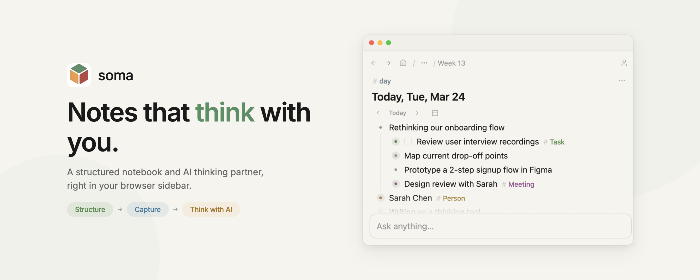
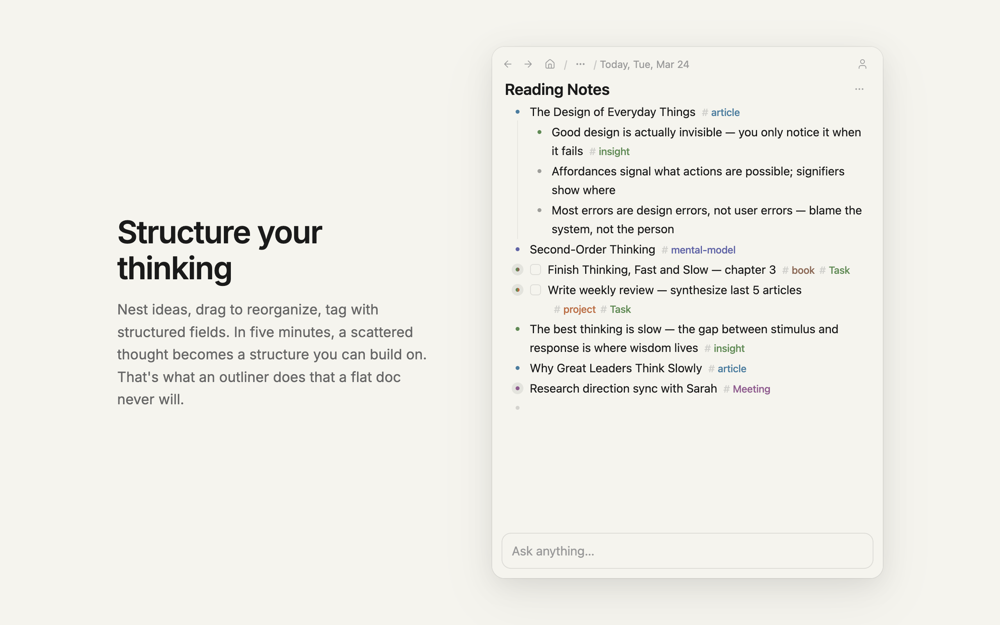
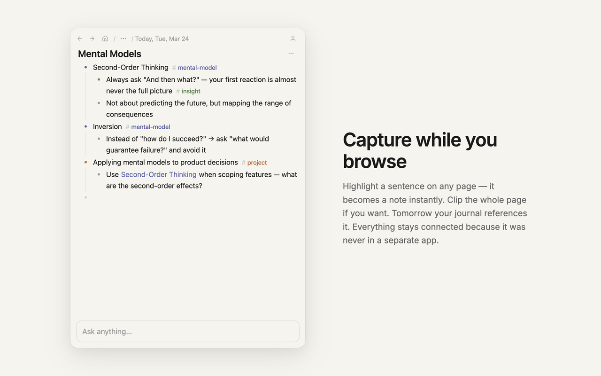
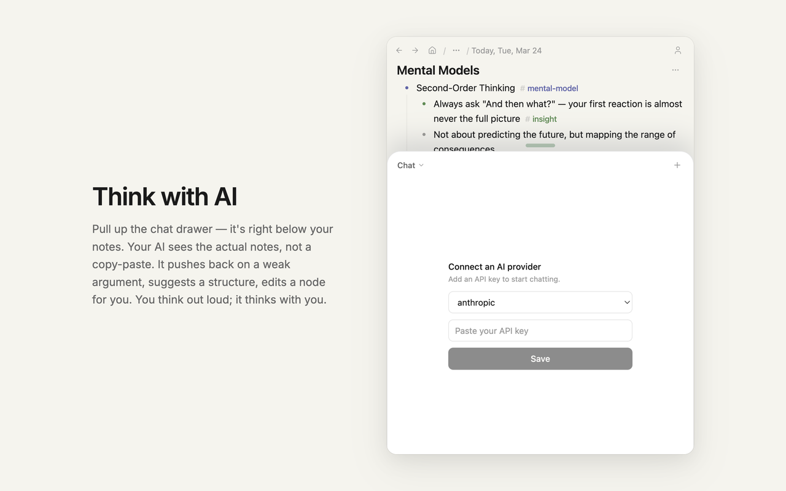

<p align="center">
  
</p>

<p align="center">
  <a href="https://chromewebstore.google.com/detail/soma-%E2%80%94-notes-that-think-w/joabcnflpakkpkalkphcdkdbfkcfhlpa"><strong>Install from Chrome Web Store</strong></a>
</p>

# soma

**Notes that think with you.**

A structured notebook and AI thinking partner, right in your browser sidebar. Capture ideas while you read, organize them into structures, and think with AI alongside your notes.

## Why soma

You're reading an article that sparks an idea. You highlight a sentence, jot a reaction in the sidebar, and keep reading. Later, you open the AI drawer and ask "what connects this to what I wrote last week?" It finds a thread you didn't see.

That's soma. Not another AI chatbot. Not another note app. It's where your notes and AI work together, so your thinking compounds over time.

## Features

### Structure your thinking



Nest ideas, drag to reorganize, tag with structured fields. In five minutes, a scattered thought becomes a structure you can build on. That's what an outliner does that a flat doc never will.

### Capture while you browse



Highlight a sentence on any page — it becomes a note in your sidebar instantly. Clip the whole page if you want. Tomorrow your journal references it. Everything stays connected because it was never in a separate app to begin with.

### Think with AI



Pull up the chat drawer — it's right below your notes. Your AI sees the actual notes, not a copy-paste. It pushes back on a weak argument, suggests a structure, edits a node for you. You think out loud; it thinks with you.

Bring your own model: Claude, GPT, Gemini, DeepSeek, or any OpenAI-compatible provider.

## Tech Stack

| Layer | Choice |
|-------|--------|
| Language | TypeScript (strict, ESM) |
| Extension Framework | [WXT](https://wxt.dev/) (Vite-based, HMR, cross-browser) |
| UI | React 19 + Tailwind CSS 4 + shadcn/ui |
| Editor | TipTap (ProseMirror) |
| State | Zustand (persist to chrome.storage) |
| Data Model | [Loro CRDT](https://loro.dev/) — offline-first, real-time sync |
| Backend | Cloudflare Workers + D1 + R2 |
| Auth | Better Auth + Google OAuth |

## Development

```bash
# Install dependencies
npm install

# Dev mode with HMR
npm run dev

# Load the extension:
# Chrome → chrome://extensions → Load unpacked → select .output/chrome-mv3-dev/

# Type check
npm run typecheck

# Run tests
npm run test:run

# Full verification (typecheck → test-sync → test → build)
npm run verify

# Production build
npm run build
```

## License

All rights reserved.
